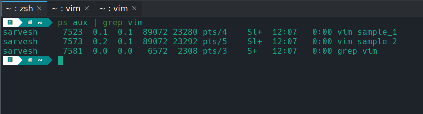
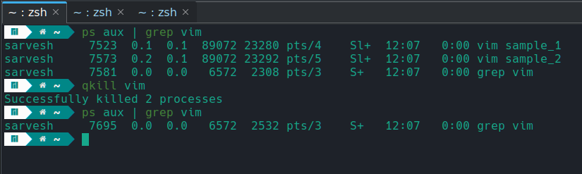
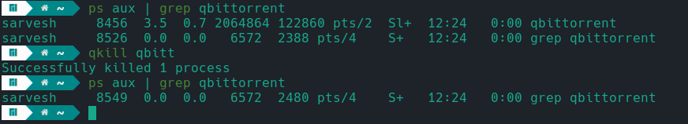

# qkill - Smart Process Termination Tool


qkill is a smart and flexible process termination tool that simplifies the process of killing processes based on patterns rather than requiring exact process names. It provides a convenient way to terminate multiple instances of a process or processes with related names using a simple command.

## Requirements:

qkill is a self-contained command-line utility for Linux systems (e.g., Ubuntu, CentOS, Fedora) with no external dependencies.

It utilizes standard Linux commands like `ps`, `grep`, `awk`, and `kill`, making it readily available on most systems. No additional requirements or installations are needed.

## Installation:

1. Clone the repository from GitHub:
```bash
git clone https://github.com/Saru2003/qkill.git
```
2. Change into the qkill directory:
```bash
cd qkill
```
3. Give execution permissions to the qkill script:
```bash
chmod +x qkill
```
4. Copy the qkill script to the /usr/local/bin directory to make it accessible system-wide:
```bash
sudo cp qkill /usr/local/bin
```

## Usage

To terminate processes based on patterns, simply use the qkill command followed by the desired pattern.
```
qkill <pattern>
```
Here are some examples:

To kill all instances of "vim" processes:
```
qkill vim
```



To terminate all processes related to "qbittorrent":
```
qkill qbitt
```



qkill will automatically detect and match any process with a name containing the specified pattern and terminate them, making it a powerful tool for process management.

## Features:

- Smart process termination based on patterns
- Simple and user-friendly command-line interface
- Allowes users to easily kill multiple instances of related processes with partial names, unlike `killall` which requires exact process names.
- No additional dependencies or requirements


By using qkill, you can quickly and efficiently terminate processes based on patterns, streamlining your process management tasks and enhancing your productivity.

Feel free to explore the repository, contribute, or raise any issues you encounter. Happy process management!

## License


All code is licensed under the GPL, v3 or later. See [LICENSE](https://github.com/Saru2003/qkill/blob/main/LICENSE) file for details.

